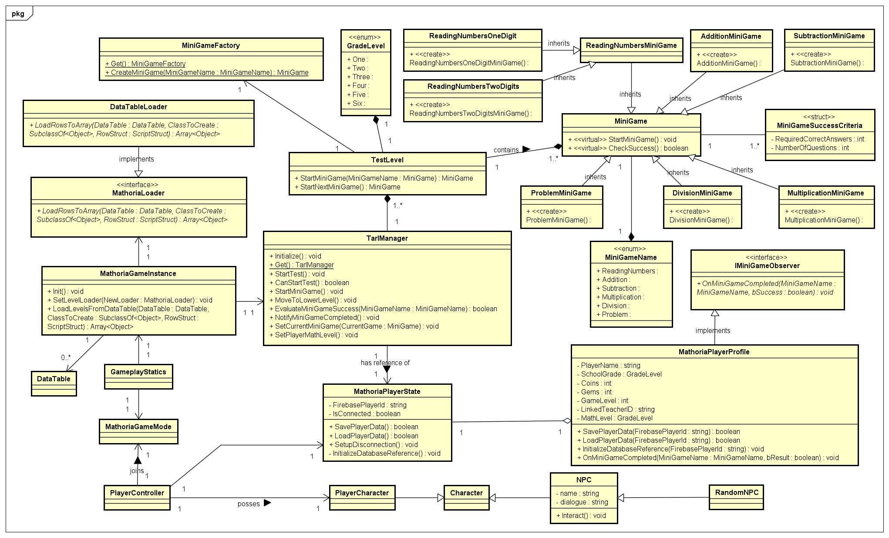

# Test Mini-Games

## Overview
The **Test Mini-Games** collection is a set of educational games designed to help students practice essential mathematical concepts across multiple grade levels. The mini-games cover topics ranging from reading numbers to solving real-world problems, with levels tailored to different student needs. These games incorporate interactive NPCs, customizable difficulty settings, and speech-based input to enhance the learning experience.

## Table of Contents
1. [Mini-Game 1: Reading Numbers](#mini-game-1-reading-numbers)
2. [Mini-Game 2: Addition of Two Numbers](#mini-game-2-addition-of-two-numbers)
3. [Mini-Game 3: Subtraction of Two Numbers](#mini-game-3-subtraction-of-two-numbers)
4. [Mini-Game 4: Multiplication of Two Numbers](#mini-game-4-multiplication-of-two-numbers)
5. [Mini-Game 5: Division of Two Numbers](#mini-game-5-division-of-two-numbers)
6. [Mini-Game 6: Real-World Problems](#mini-game-6-real-world-problems)
7. [System Components](#system-components)
8. [Technical Requirements](#technical-requirements)
9. [Installation Instructions](#installation-instructions)
10. [Gamification Elements](#gamification-elements)
11. [Teacher Dashboard Integration](#teacher-dashboard-integration)
12. [Important Update](#important-update)
13. [Contributing](#contributing)
14. [Contact](#contact)

---

## Mini-Game 1: Reading Numbers

### **Target Grades**: Grades 1–6  
**Description**: Students practice recognizing and reading single-digit and double-digit numbers using **Speech-to-Text** technology. NPC avatars guide and provide feedback throughout the game.

**Levels**:
- Level 1: Single-digit numbers (0–10)
- Level 2 or higher: Double-digit numbers (11–99)

**Success Criteria**:
- Single-Digit: All correct.
- Double-Digit: At least 6 out of 8 correct.

**Customization**:
- Number of digits, test duration, display speed, and number of correct answers.

---

## Mini-Game 2: Addition of Two Numbers

### **Target Grades**: Grades 2–6  
**Description**: Students solve horizontal addition problems, with at least two operations per equation. NPC avatars provide verbal encouragement.

**Success Criteria**:
- At least 2 correct answers.

**Customization**:
- Number of operations, time limits, difficulty, number size, and correct answers required.

---

## Mini-Game 3: Subtraction of Two Numbers

### **Target Grades**: Grades 3–6  
**Description**: Students practice solving subtraction problems with varying difficulty. Permutations of numbers may be used for added complexity. NPC avatars offer feedback.

**Success Criteria**:
- At least 2 correct answers.

**Customization**:
- Difficulty level, number of operations, time limits, number of correct answers, and number size.

---

## Mini-Game 4: Multiplication of Two Numbers

### **Target Grades**: Grades 4–6  
**Description**: Students practice solving multiplication problems with increasing complexity, starting from single-digit numbers multiplied by two-digit numbers for grade 4 to two-digit numbers multiplied by two-digit numbers for higher grades.

**Success Criteria**:
- At least 2 correct answers.

**Customization**:
- Number size, problem count, time limits, and correct answers required.

---

## Mini-Game 5: Division of Two Numbers

### **Target Grades**: Grades 5–6  
**Description**: Students solve division problems involving three-digit numbers divided by single-digit numbers. NPC avatars explain the problems when necessary.

**Success Criteria**:
- At least 2 correct answers.

**Customization**:
- Time limits, difficulty, number size, and correct answers required.

---

## Mini-Game 6: Real-World Problems

### **Target Grades**: Grades 2–6  
**Description**: Students solve real-world math problems. This includes multiple-choice questions for simple problems and open-ended questions where students write steps and operations for more complex problems.

**Success Criteria**:
- Correct operations and accurate final answer.

**Customization**:
- Number of problems, content, difficulty, and number size.

---

## System Components

### ⚙️ **Existing Classes & Structures**

- **`UTestLevel`**: Defines test levels, thresholds, and evaluation rules.
- **`UMiniGame`**: Manages individual mini-game mechanics.
- **`FMiniGameSuccessCriteria`**: Handles pass/fail criteria for mini-games.
- **`UTarlManager`**: Manages transitions between levels/mini-games using decision-tree logic.
- **`EGradeLevel`, `EMiniGameName`**: Enums to handle grade and mini-game selection.
- **`IMiniGameObserver`**: Interface for observing game events.
- **`ANPC`, `AExaminerNPC`**: NPC avatars that guide and motivate students.
- **`UMiniGameObserver`**: Handles notifications from the game systems.
- **`UReadingNumbersMiniGame`, `UAdditionMiniGame`, `USubtractionMiniGame`, etc.**: Classes for specific mini-games.
- **`UMathoriaGameInstance`, `UMathoriaPlayerProfile`, `AMathoriaPlayerState`**: Core player data and game management.
- **`UMathoriaUserWidget`**: Base class for custom UI widgets.
- **`UPaintWidget`**: Specialized widget for drawing functionalities, inherits from `UMathoriaUserWidget`.
- **`WBP_DrawingCanvas`**: Blueprint implementation of `UPaintWidget` for easy UI integration.

For a detailed explanation of the class structure, please refer to the diagram above and the contents of the `Source` folder.

---

## Technical Requirements

- **Unreal Engine:**  
  C++ is used for game logic, including a simple dialogue system between the player and NPCs, tracking answers, levels, and progression.  
  UMG Widgets are used to display problems, choices, and responses.  

- **Speech-to-Text (Arabic):**  
  Arabic Speech-to-Text integration is used for number reading and responses (on devices with voice recognition support) in [Mini-Game 1: Reading Numbers](#mini-game-1-reading-numbers).

  **Integration Methods:**  
  1. **Hosted API Approach:** Deploy an Arabic STT model on a free server (e.g., Vercel). Unreal Engine communicates with the API using the [HTTP module](https://dev.epicgames.com/community/learning/tutorials/ZdXD/call-rest-api-using-http-json-from-ue5-c). *Note:* Free servers like Vercel may have API rate limits and latency issues, which could affect real-time performance.
  2. **On-Device Model (Offline Option):** Integrate Mozilla’s DeepSpeech fine-tuned for Arabic using Python/C++ bindings. *Note:* On-device models may require significant processing power, which could be a limitation on lower-end mobile devices.

  **Open-Source Reference:** [Arabic Speech Recognition](https://github.com/ARBML/klaam).

- **Text-to-Speech (Arabic):**  
  NPC avatars provide guidance, prompts, and feedback using Arabic Text-to-Speech (TTS) technology, applied across all Test Mini-Games.

  **Integration Methods:**  
  1. **Hosted API Approach:** Host an Arabic TTS model (e.g., ARBML/klaam) on a free server (e.g., Vercel). Unreal Engine sends text via HTTP requests and plays the received audio. *Note:* Free hosting may introduce latency and API call limitations.
  2. **Pre-Generated Audio:** Generate static dialogues during development and store `.wav`/`.ogg` files in Unreal's Content Browser for quick playback. *Note:* This approach won't be valid in the future when migrating from static questions and problems to AI-generated questions and problems based on the student's profile.

  **Open-Source Reference:** [Arabic Text-to-Speech](https://github.com/ARBML/klaam).

- **NPC Avatars:**  
  3D NPC characters provide feedback through animations and facial expressions to engage students.  

- **Handwriting Recognition:**  
  A 2D Paint Interface is integrated for handwritten input, used in providing answers in Mini-Games 2 to 5.

  **Integration Methods:**  
  1. **Hosted API Approach:** Capture handwriting as an image, convert it to Base64, and send it to a recognition API hosted on a free server (e.g., Vercel) using Unreal's HTTP module. *Note:* Free servers may have rate limits and slower response times.
  2. **On-Device ML Model:** Implement TensorFlow Lite models for local handwriting recognition integrated with Unreal via custom C++ bindings. *Note:* On-device ML models may demand higher CPU/GPU resources, potentially affecting performance on entry-level devices.

  **Open-Source Reference:** [Recognizing Multiple Handwritten Digits](https://github.com/aryashah2k/Handwritten-Multiple-Digits-Recognizer/).

- **Progression:**  
  Each mini-game features a progression system where students unlock more challenging levels as they answer correctly.  
  A feedback system is integrated to reinforce students’ performance.

---

## Gamification Elements

- **NPC Avatars**: Provide verbal guidance, feedback, and motivation.
- **Rewards**: GameLevel (XP) increases after completing the test. Score accumulates after each mini-game, and the final score is displayed after completing the test along with the real-math grade level of the player.
- **Progress Tracking**: Visual progress bars and level indicators.
- **Animations**: Fun transitions and celebratory effects for correct answers.

---

## Teacher Dashboard Integration

- **Customization of Test Parameters**: Teachers can customize test difficulty, duration, problem count, and the number of correct answers required.
- **Real-Time Monitoring of Student Performance**: Track student performance in real-time while they are engaging with the mini-games.
- **Analytics & Reports**: Teachers have access to detailed analytics, showing student progress, areas of strength, and areas for improvement. Reports can be generated based on student performance, helping educators adjust teaching strategies as needed.
- **Link to GitHub Repo**: [GitHub Repository for Teacher Dashboard](https://github.com/najlae01/math-web.git)

---

## Important Update 
We are making a key change to how students/players create and access their game accounts. Going forward, students will not be able to create accounts themselves—only teachers or school administrators can do so.

To streamline this process, we are removing the in-game authentication form. Instead, students will log in using a QR code provided by their teacher upon account creation.

In the future, we plan to introduce fingerprint authentication as an option for compatible devices.

---

## Installation Instructions

1. Clone or download the project files from the repository.

2. **Create a Firebase Console Account:**
   - Go to [Firebase Console](https://console.firebase.google.com/).
   - Create a new project named "Math Test Game."

3. **Add Android and Web Apps:**
   - In your Firebase project settings, add an Android app and a Web app.

4. **Enable Authentication:**
   - Go to "Authentication" and enable Email and Google sign-in methods.

5. **Configure Realtime Database:**
   - Enable "Realtime Database" and set up the rules as needed.

6. **Download Configuration File:**
   - In "Project Settings" under Android apps, download the `google-services.json` file.
   - Add your Developer SHA Certificate Fingerprints for Android.

7. **Organize Project Files:**
   - Create a `Services` folder in the project directory and place `google-services.json` inside.
   - Create a `Plugins` folder and add the shared Firebase plugin there.

8. **Build the Project:**
   - Right-click the `.uproject` file.
   - Choose "Show more options" > "Generate Visual Studio Project files."
   - Open the `.sln` file in Visual Studio and build the project.

9. **Run the Game:**
   - After a successful build, open the `.uproject` file and run the game.

---

## Contributing

We welcome contributions to improve these mini-games!

1. Fork the repository.
2. Create your group branch (`git checkout -b group-one`).
3. Commit your changes (`git commit -am 'Add group-one'`).
4. Push to your branch (`git push origin group-one`).
5. Open a pull request with detailed descriptions of your changes.

---

## Contact

For support, contact [Najlae](mailto:najlae.abarghache@etu.uae.ac.ma).

